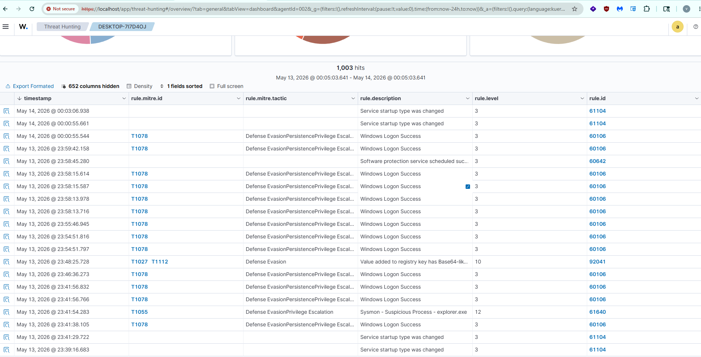
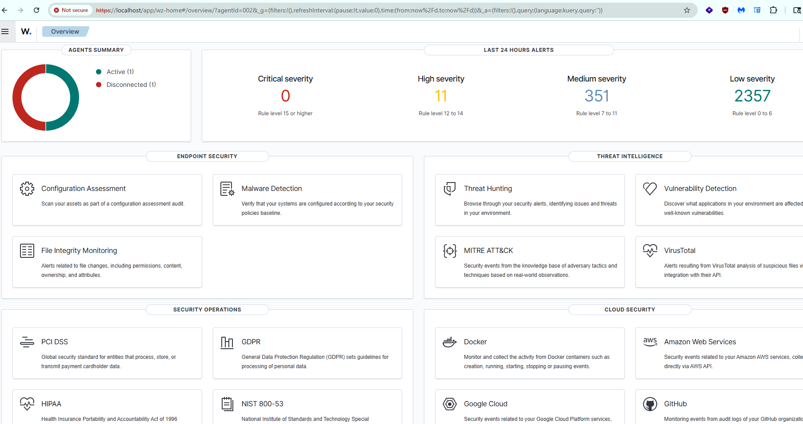

# Wazuh SOC Automation & Threat Detection Lab

## **1. Project Overview**
This lab demonstrates the implementation of an end-to-end **Security Operations Center (SOC)** environment. The primary objective was to establish granular visibility into endpoint activities and automate the detection of advanced adversary techniques using **Wazuh SIEM** and **Sysmon** telemetry.

## **2. Technical Architecture**
The environment consists of a cross-platform network featuring a dedicated SIEM manager, a Windows 10 victim host, and a Kali Linux attack platform.
*   **SIEM:** Wazuh (Manager/Indexer/Dashboard) deployed via Docker.
*   **Endpoint Monitoring:** Sysmon integrated with the Wazuh agent for process-level visibility.
*   **Network:** All telemetry is encrypted and shipped via Port 1514.

## **3. Advanced Threat Detections**

### **Case Study 1: Privilege Escalation (T1484)**
I configured custom detection logic to identify unauthorized administrative changes and identity manipulation.
*   **Analysis:** The SIEM successfully correlated the creation of a new user account with its subsequent promotion to the "Administrators" group, triggering a high-severity alert.
*   **Evidence:**

### **Case Study 2: Process Injection & Defense Evasion (T1055)**
Using Sysmon Event ID 8 (CreateRemoteThread), I detected a "Fileless" attack where malicious code was injected into a legitimate system process.
*   **Analysis:** Monitoring `explorer.exe` for suspicious thread activity allowed for the detection of memory-resident malware that standard Windows Event Logs would have bypassed.
*   **Evidence:**

## **4. Operational Dashboard**
The SIEM dashboard provides real-time situational awareness, tracking security events mapped across the MITRE ATT&CK framework.

## **5. Technical Skills Demonstrated**
*   **SIEM Operations:** Log collection, decoder/rule configuration, and alert engineering.
*   **Endpoint Detection (EDR):** Deploying and tuning Sysmon for high-fidelity telemetry.
*   **Attack Simulation:** Executing controlled exploits using Atomic Red Team to validate defenses.
*   **Infrastructure:** Linux/Windows administration and Docker containerization.

## **Project Architecture**

[ Targeted Windows 10 Endpoint ]
         │  (Generates Host Telemetry)
         ▼
  ┌──────────────┐
  │ Sysmon Logs  │ ──► Captures Process Spawning & Registry Changes
  └──────────────┘
         │
         ▼ (Forwarded via Encrypted Agent Channel)
  ┌──────────────────────────────────────────────┐
  │         Containerized Wazuh Manager          │ ──► Runs inside Docker Compose
  │ (Decodes, Parses, & Correlates Log Telemetry)│
  └──────────────────────────────────────────────┘
         │
         ▼ (Triggers Detection Alerts)
  ┌──────────────────────────────────────────────┐
  │       Wazuh Dashboard / Alerts Panel        │ ──► Security Analyst Interface
  └──────────────────────────────────────────────┘
         │
         ▼ (If Rule Triggers Active Response)
  [ Automated Containment Script Executed on Endpoint ]
