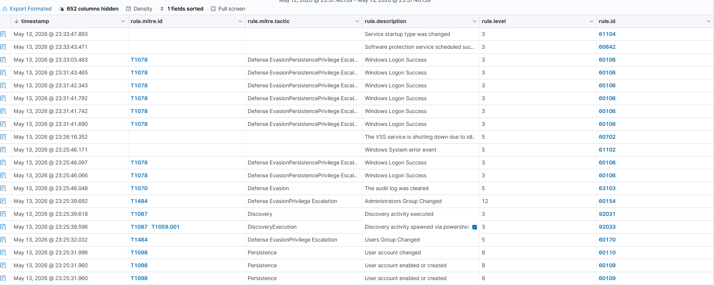

# Wazuh SOC Automation Lab

## 1. Project Overview
I built a functional SOC (Security Operations Center) home lab to detect real-world cyber attacks. I used **Wazuh** as the SIEM and **Sysmon** for deep monitoring.

## 2. Lab Architecture
This diagram shows how my Attacker, Victim, and SIEM Manager are connected.

## 3. Real-World Detections (Evidence)
I successfully caught and analyzed these attacks:

### **Attack Timeline (The Kill Chain)**
I tracked an attacker creating a user, giving them admin rights, and then clearing the logs.

### **Advanced Detection (Process Injection)**
I used Sysmon to catch a hidden attack inside the "explorer.exe" process.

